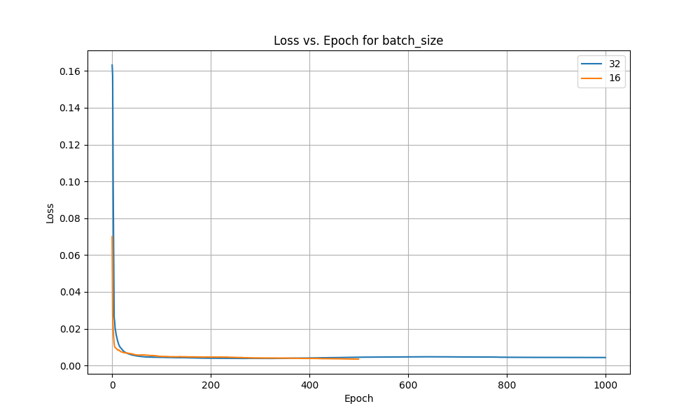

# Assignment 3 Report
### by `Pratyush Jena`

## Summary

### 1. Model Architecture & Features
- Implemented a flexible Multi-Layer Perceptron (MLP) from scratch supporting:
  - Multiple hidden layers with customizable sizes
  - Various activation functions (ReLU, Sigmoid, Tanh, Linear)
  - Different loss functions (MSE, Cross-Entropy)
  - Multiple optimization methods (SGD, Mini-batch, Full-batch)
  - Weight initialization schemes (Random, He, Xavier/Glorot)
  - Early stopping for regularization

### 2. Implementation Details
- Core Components:
  ```python
  class MLP:
      def __init__(self, input_size, hidden_layers, output_size, ...):
          self.weights = []  # List of weight matrices
          self.biases = []   # List of bias vectors
          self._initialize_weights()  # He/Xavier/Random init
          
      def forward(self, X):
          # Layer-wise forward propagation
          activations = []
          for W, b in zip(self.weights, self.biases):
              X = self._activation(np.dot(X, W) + b)
              activations.append(X)
          return activations
          
      def backward(self, error, activations):
          # Backpropagation through layers
          gradients = []
          for layer in reversed(range(len(self.weights))):
              error = self._compute_gradient(error, activations[layer])
              gradients.insert(0, error)
          return gradients
  ```

- Key Methods:
  - `fit()`: Training loop with batch processing
  - `predict()`: Forward pass for inference
  - `evaluate()`: Loss computation
  - `_update_weights()`: Gradient descent step

### 3. Multi-Class Classification Results
- Best performing model configuration:
  - Activation: Tanh
  - Batch size: 16
  - Learning rate: 1.0
  - Hidden layers: [32,32]
- Test metrics:
  - Accuracy: 58.77%
  - F1-Score: 0.311
  - Precision: 0.291
  - Recall: 0.335

### 4. Multi-Label Classification Analysis
- Implementation:
  ```python
  def multi_label_metrics(y_true, y_pred):
      # Per-label metrics
      precision = true_positives / (true_positives + false_positives)
      recall = true_positives / (true_positives + false_negatives)
      f1 = 2 * (precision * recall) / (precision + recall)
      return precision, recall, f1
  ```
- Performance:
  - Micro-averaged Precision: 0.20
  - Micro-averaged Recall: 0.71
  - Micro-averaged F1: 0.31

### 5. AutoEncoder Implementation
- Architecture:
  ```python
  # Symmetric encoder-decoder structure
  layers = [input_size] + hidden_layers + [latent_dim] + \
          hidden_layers[::-1] + [input_size]
  ```
- Results:
  - 99.99% reconstruction accuracy
  - Latent space: 15 → 6 dimensions
  - KNN accuracy: 24.93% → 12.54% (compressed)

### 6. Key Findings & Improvements
- Activation function choice significantly impacts model performance
- Batch size affects both training stability and convergence speed
- Learning rate tuning crucial for optimal performance
- Future work:
  - Add more sophisticated regularization
  - Enhance autoencoder architecture
  - Implement cross-validation

### 7. Regression Task Performance
- Best configuration:
  - ReLU activation
  - Batch size: 16
  - Learning rate: 0.1
  - Hidden layers: [16,16]
- Test metrics:
  - R-squared: 0.927
  - RMSE: 0.071
  - MAE: 0.056

### 8. Loss Function Analysis (MSE vs BCE)
- Compared behavior of MSE and Binary Cross-Entropy:
  - MSE showed more stable convergence
  - BCE operated on larger scale with faster initial convergence
  - Both avoided overfitting with validation loss remaining below training loss

### 9. Tools & Integration
- Integrated with Weights & Biases for experiment tracking
- Comprehensive logging of metrics and hyperparameters
- Visualization support for training progress and results

## Dataset Analysis and Preprocessing

### First few rows
```
First few rows of the dataset:
    fixed acidity  volatile acidity  citric acid  residual sugar  chlorides  \
0            7.4              0.70         0.00             1.9      0.076   
1            7.8              0.88         0.00             2.6      0.098   
2            7.8              0.76         0.04             2.3      0.092   
3           11.2              0.28         0.56             1.9      0.075   
4            7.4              0.70         0.00             1.9      0.076   

   free sulfur dioxide  total sulfur dioxide  density    pH  sulphates  \
0                 11.0                  34.0   0.9978  3.51       0.56   
1                 25.0                  67.0   0.9968  3.20       0.68   
2                 15.0                  54.0   0.9970  3.26       0.65   
3                 17.0                  60.0   0.9980  3.16       0.58   
4                 11.0                  34.0   0.9978  3.51       0.56   

   alcohol  quality  Id  
0      9.4        5   0  
1      9.8        5   1  
2      9.8        5   2  
3      9.8        6   3  
4      9.4        5   4  

```

### Numerical Cols

```
Dataset Description (Numerical Columns):
        fixed acidity  volatile acidity  citric acid  residual sugar  \
count    1143.000000       1143.000000  1143.000000     1143.000000   
mean        8.311111          0.531339     0.268364        2.532152   
std         1.747595          0.179633     0.196686        1.355917   
min         4.600000          0.120000     0.000000        0.900000   
25%         7.100000          0.392500     0.090000        1.900000   
50%         7.900000          0.520000     0.250000        2.200000   
75%         9.100000          0.640000     0.420000        2.600000   
max        15.900000          1.580000     1.000000       15.500000   

         chlorides  free sulfur dioxide  total sulfur dioxide      density  \
count  1143.000000          1143.000000           1143.000000  1143.000000   
mean      0.086933            15.615486             45.914698     0.996730   
std       0.047267            10.250486             32.782130     0.001925   
min       0.012000             1.000000              6.000000     0.990070   
25%       0.070000             7.000000             21.000000     0.995570   
50%       0.079000            13.000000             37.000000     0.996680   
75%       0.090000            21.000000             61.000000     0.997845   
max       0.611000            68.000000            289.000000     1.003690   

                pH    sulphates      alcohol           Id  
count  1143.000000  1143.000000  1143.000000  1143.000000  
mean      3.311015     0.657708    10.442111   804.969379  
std       0.156664     0.170399     1.082196   463.997116  
min       2.740000     0.330000     8.400000     0.000000  
25%       3.205000     0.550000     9.500000   411.000000  
50%       3.310000     0.620000    10.200000   794.000000  
75%       3.400000     0.730000    11.100000  1209.500000  
max       4.010000     2.000000    14.900000  1597.000000  

```

### Distribution of Wine Quality Labels


### Normalised

```
   fixed acidity  volatile acidity  citric acid  residual sugar  chlorides  \
0       0.247788          0.397260         0.00        0.068493   0.106845   
1       0.283186          0.520548         0.00        0.116438   0.143573   
2       0.283186          0.438356         0.04        0.095890   0.133556   
3       0.584071          0.109589         0.56        0.068493   0.105175   
4       0.247788          0.397260         0.00        0.068493   0.106845   

   free sulfur dioxide  total sulfur dioxide   density        pH  sulphates  \
0             0.149254              0.098940  0.567548  0.606299   0.137725   
1             0.358209              0.215548  0.494126  0.362205   0.209581   
2             0.208955              0.169611  0.508811  0.409449   0.191617   
3             0.238806              0.190813  0.582232  0.330709   0.149701   
4             0.149254              0.098940  0.567548  0.606299   0.137725   

    alcohol        Id  quality  
0  0.153846  0.000000        5  
1  0.215385  0.000626        5  
2  0.215385  0.001252        5  
3  0.215385  0.001879        6  
4  0.153846  0.002505        5 
```
``./data/interim/wine_normalized.csv``

### Standardized
```
fixed acidity  volatile acidity  citric acid  residual sugar  chlorides  \
0      -0.521580          0.939332    -1.365027       -0.466421  -0.231395   
1      -0.292593          1.941813    -1.365027        0.050060   0.234247   
2      -0.292593          1.273492    -1.161568       -0.171289   0.107253   
3       1.653789         -1.399789     1.483400       -0.466421  -0.252560   
4      -0.521580          0.939332    -1.365027       -0.466421  -0.231395   

   free sulfur dioxide  total sulfur dioxide   density        pH  sulphates  \
0            -0.450467             -0.363610  0.555854  1.270695  -0.573658   
1             0.915920              0.643477  0.036165 -0.708928   0.130881   
2            -0.060071              0.246745  0.140103 -0.325775  -0.045254   
3             0.135127              0.429852  0.659792 -0.964363  -0.456235   
4            -0.450467             -0.363610  0.555854  1.270695  -0.573658   

    alcohol        Id  quality  
0 -0.963382 -1.735618        5  
1 -0.593601 -1.733462        5  
2 -0.593601 -1.731306        5  
3 -0.593601 -1.729150        6  
4 -0.963382 -1.726993        5  
```
`./data/interim/wine_standardized.csv`

## Model

1. **Flexible Architecture**: Supports customizable input size, hidden layers, and output size.

2. **Activation Functions**: Implements ReLU, Sigmoid, Tanh, and Linear activation functions.

3. **Loss Functions**: Supports Mean Squared Error (MSE) and Cross-Entropy loss.

4. **Optimization Methods**: 
   - Stochastic Gradient Descent (SGD)
   - Mini-batch Gradient Descent
   - Full-batch Gradient Descent

5. **Weight Initialization**: Offers random, He, and Xavier/Glorot initialization methods.

6. **Regularization**: Implements early stopping to prevent overfitting.

7. **Performance Metrics**: Includes various metrics for different tasks:
   - For classification: Accuracy, Precision, Recall, F1-score
   - For multi-label classification: Hamming Loss, Partial Accuracy, Micro/Macro metrics

8. **Gradient Checking**: Includes a method to verify the correctness of gradient computations.

9. **Integration with Weights & Biases**: Supports logging of training progress and metrics.

### Model Types
The model supports three types of tasks:
1. Multi-class Classification (`class_MC`)
2. Multi-label Classification (`class_ML`)
3. Regression (`regression`)

### Training Process
The model uses a forward-backward propagation approach for training:
1. Forward pass to compute activations and loss
2. Backward pass to compute gradients
3. Weight updates using the chosen optimization method

### Notable Methods
- `fit()`: Main training loop
- `predict()`: Make predictions on new data
- `evaluate()`: Compute loss on given data
- `check_gradients()`: Verify gradient computations

#### Check_Gradient run
```
Gradient difference: 1.142974952389726e-13
Gradients are correct
```

### Customization
The model allows for extensive customization through its initialization parameters, including learning rate, batch size, number of epochs, activation functions, and more.

## Hyperparameter Tuning using W&B 

1. link to wandb: `https://wandb.ai/proton_prat/SMAI_A3-MLP/table`
2. Single-label Classification Model RunName = 
    `hyperparam_MC_3_test `
3. workspace URL - `https://wandb.ai/proton_prat/SMAI_A3-MLP/table`

4. Table of the run
    

### Change or Loss vs Hyperparams

1. Accuracy vs epoch for activation functions

b_size=32, lr=0.01, beta=0.9, hl=[32,32]

2. Accuracy vs epoch for batch_size

func=tanh, lr=0.01, beta=0.9, hl=[32,32]

3. Accuracy vs epoch for learning_rate

func=tanh, b_size=32, beta=0.9, hl=[32,32]

### Table

```
 Run Name  Learning Rate  Batch Size Activation Function  ...  Val Loss Val Precision  Val Recall  Val F1 Score
15  hyperparam_MC_3_test-tanh-mini_batch-cross_ent...           1.00          16                None  ...  1.503772      0.338384    0.329460      0.333862      
9   hyperparam_MC_3_test-sigmoid-mini_batch-cross_...           1.00          32                None  ...  0.940586      0.299976    0.297878      0.298923      
4   hyperparam_MC_3_test-relu-mini_batch-cross_ent...           1.00          32                None  ...  0.991517      0.330739    0.336678      0.333682      
16  hyperparam_MC_3_test-tanh-mini_batch-cross_ent...           1.00          32                None  ...  0.940672      0.324459    0.307365      0.315681      
14  hyperparam_MC_3_test-tanh-mini_batch-cross_ent...           0.10          16                None  ...  0.948107      0.312718    0.304032      0.308314      
13  hyperparam_MC_3_test-tanh-mini_batch-cross_ent...           0.10          32                None  ...  0.944075      0.291249    0.294332      0.292782      
0   hyperparam_MC_3_test-relu-mini_batch-cross_ent...           0.10          32                None  ...  0.956835      0.282896    0.281511      0.282202      
22  hyperparam_MC_3_test-linear-mini_batch-cross_e...           0.10          32                None  ...  0.964784      0.283965    0.281724      0.282840      
21  hyperparam_MC_3_test-linear-mini_batch-cross_e...           0.01          16                None  ...  0.962290      0.272447    0.272662      0.272554      
23  hyperparam_MC_3_test-linear-mini_batch-cross_e...           0.01          32                None  ...  0.943686      0.253050    0.262537      0.257706      
```
`./assignments/3/sorted_hyperparameter_metrics_based_on_val_accuracy.csv`

### Best model
hyperparam_MC_3_test-tanh-mini_batch-cross_entropy-he-1000-1-16

1. Test
    ```
    {
    "_runtime": 30.468347787857056,
    "_step": 1001,
    "_timestamp": 1728715026.4222658,
    "_wandb.runtime": 29,
    "accuracy": 0.5877192982456141,
    "data": "Test",
    "epoch": 1000,
    "f1_score": 0.31135370049975725,
    "precision": 0.29079987098855026,
    "recall": 0.33503401360544216,
    }
    ```

2. Val


3. train


## Evaluating Single-label Classification Model 

### Evaluation on the Test Set:
The metrics captured below are derived from the final run of your model:

| **Metric**       | **Value**                         | **Data**    |
|------------------|-----------------------------------|-------------|
| **Accuracy**      | 0.605                            | Test        |
| **F1-Score**      | 0.311                            | Test        |
| **Precision**     | 0.323                            | Test        |
| **Recall**        | 0.300                            | Test

### Summary of Observations:
- **Accuracy**: Your model achieved an accuracy of **60.5%** on the test set, which indicates it correctly classified approximately 60% of the examples.
- **F1-Score**: The F1-Score of **0.311** suggests that the model has moderate balance between precision and recall on the test set.
- **Precision**: The precision of **0.323** indicates that out of all predicted positives, about 32.3% were true positives.
- **Recall**: The recall of **0.300** reflects that the model was able to identify approximately 30% of all actual positive cases.

### Analysis:
- **Training vs Validation Accuracy**: The accuracy on the validation set (64.3%) is higher than the training accuracy (60.2%), which might indicate that the model is generalizing fairly well.
- **Loss**: Validation loss is lower than training loss, which suggests the model is learning but has room for improvement.
- **Test Performance**: The test accuracy is **60.5%**, slightly lower than the validation accuracy, which is expected in real-world scenarios. However, the model's performance metrics (precision, recall, F1-score) are somewhat lower, indicating there could be challenges in balancing false positives and false negatives.

## Analyzing Hyperparameters Effects

### Observations on Activation Functions:
1. Effect of Non-linearity


Based on the graph showing **loss vs. epoch** for various activation functions (`relu`, `sigmoid`, `tanh`, and `linear`), we can draw some key observations regarding the influence of each activation function on the model's convergence:


- **ReLU** is one of the best performing activation functions in terms of both speed and final convergence. It allows for rapid updates and does not saturate like sigmoid.
- **Tanh** performs better than `sigmoid`, with a smooth, steady decrease in loss, making it a solid choice if ReLU doesn't work well (e.g., in cases of vanishing gradients or exploding gradients).
- **Sigmoid** converges very slowly and has a higher final loss, likely due to the vanishing gradient problem.
- **Linear** activation does not improve significantly after the initial few epochs, suggesting that it may not be suitable for capturing the complexity of the data in this task.

### Observations on Learning Rate:
2. Effect of Learning Rate


    1. **Learning Rate = 1 (red line):**
        - **Very Fast Initial Drop**: This learning rate exhibits a rapid decrease in loss during the early epochs, showing the fastest convergence initially.
        - **Early Plateau**: However, after about 20 epochs, the loss reaches a plateau, suggesting that the model quickly converges to a suboptimal solution. This may indicate that a learning rate of 1 is too high, causing the model to overshoot the global minimum.

    2. **Learning Rate = 0.1 (orange line):**
        - **Quick Initial Convergence**: This learning rate shows a relatively fast drop in loss, though not as rapid as `1`.
        - **Good Convergence**: The model continues to reduce loss steadily but reaches a plateau earlier compared to lower learning rates. It converges to a better solution than `1` but is still not the lowest.
        - **Stability**: This rate is reasonably fast and stable, making it suitable for certain scenarios.

    3. **Learning Rate = 0.01 (green line):**
        - **Balanced Convergence**: The model shows a smooth and steady reduction in loss throughout the 100 epochs. This indicates that the learning rate is neither too fast nor too slow, allowing the model to continue improving without plateauing too early.
        - **No Overshooting**: Unlike `1`, the model does not overshoot the optimal solution. It maintains a balanced approach to learning.

    4. **Learning Rate = 0.001 (blue line):**
        - **Slowest Convergence**: While the model steadily reduces its loss, the learning rate of `0.001` results in the slowest convergence.
        - **Not Reached Optimal Solution**: By the 100th epoch, the loss is still decreasing, but at a slower rate, suggesting that it will take significantly more epochs to reach an optimal solution.

### Batch size

3. Effect of Batch Size


1. **Batch Size 8** (Orange line):
   - This batch size has the fastest initial decrease in loss but shows more oscillations and instability, indicating more noise during training.
   - The model seems to have more fluctuations and takes longer to converge compared to other batch sizes.

2. **Batch Size 16** (Blue line):
   - This batch size has a smooth loss curve with fewer oscillations than batch size 8.
   - It converges steadily, showing a balance between stability and speed of convergence. It reaches the lowest loss among the batch sizes by the end of 100 epochs.

3. **Batch Size 32** (Green line):
   - This batch size has a slower convergence rate compared to batch sizes 8 and 16.
   - The curve is smooth and stable, but it does not reach as low a loss as batch sizes 8 or 16.

4. **Batch Size 64** (Red line):
   - This batch size shows the slowest decrease in loss, with a significantly higher final loss compared to other batch sizes.
   - The model struggles to converge, with the loss plateauing early and staying higher than the others.

4. **Batch Size 16** (Blue line):
   - This batch size has a smooth loss curve with fewer oscillations than batch size 8.
   - It converges steadily, showing a balance between stability and speed of convergence. It reaches the lowest loss among the batch sizes by the end of 100 epochs.

### General Observations:
- **Smaller batch sizes (8 and 16)** tend to converge faster, but they introduce more noise, especially in batch size 8. This noise can sometimes help escape local minima but can also lead to instability.
- **Larger batch sizes (32 and 64)** provide more stable convergence, but they tend to converge slower, and in this case, batch size 64 performs poorly, potentially due to the model getting stuck in a higher loss region.
  
A batch size of 16 appears to strike the best balance between convergence speed and stability.

## Multi-Label Classification

1. Used the same class as before pass model_type=`class_ml` for multi-label

2. W&B `https://wandb.ai/proton_prat/SMAI_A3-MLP/table`

run_names = `tuning_ml_1`

3. Best Model: `tuning_ML_1-linear-mini_batch-cross_entropy-he-1000-0.01-32`

config parameters:
```
activation:"linear"
batch_size:32
beta:0.9
early_stopping:true
epochs:1,000
hidden_layer_sizes=[32,32]
input_size:9
learning_rate:0.01
loss_function:"cross_entropy"
optimizer:"mini_batch"
output_size:8
Random_state:null
weight_init:"he"
```
### Analysis

#### Encoding MAP
```
Binary Labels DataFrame:
    beauty  books  clothing  electronics  food  furniture  home  sports
0       0      0         1            1     0          0     0       1
1       1      0         0            0     0          1     0       0
2       0      0         1            1     1          0     0       1
3       0      0         0            0     1          0     0       0
4       0      0         0            0     0          0     1       0
```

#### Confusion Matrix per Label
```
Beauty
[[[63  0]
  [36  1]]
Books
 [[64  3]
  [29  4]]
Clothing
 [[60  5]
  [28  7]]
Electronincs
 [[61  3]
  [34  2]]
Food
 [[61  2]
  [37  0]]
Furniture
 [[76  0]
  [24  0]]
Home
 [[61  0]
  [38  1]]
Sports
 [[54 12]
  [24 10]]]

tp tn
fp fn

```

Based on the provided **confusion matrices** for each class, let's analyze how well the model performed per category by examining True Positives (TP), False Positives (FP), False Negatives (FN), and True Negatives (TN). This will help us understand where the model excelled or struggled.

---

### **Classes the Model Did Well**  
We can consider a class as being well-classified if:
1. It has **high True Positives (TP)** and **low False Negatives (FN)** (i.e., it catches most positive cases).  
2. It also has **low False Positives (FP)** (i.e., it avoids misclassifying other classes into this one).

#### 1. **Furniture**  
   ```
   [[76  0]
    [24  0]]
   ```
   - **76 TP**: The model catches all furniture-related items without missing any.
   - **0 FN**: No furniture item was missed.
   - **However:** The FP is **24**, meaning the model sometimes confuses other items as Furniture.

   **Reason for Success:**  
   - **Furniture** might be an easy class to identify, with distinctive features that the model can recognize (e.g., shapes, textures, or size-related features).

#### 2. **Books**  
   ```
   [[64  3]
    [29  4]]
   ```
   - **High TP (64)** and **Low FN (3)** indicate that the model is very good at detecting books.
   - The **FP of 29** shows some misclassification, but this is relatively manageable.

   **Reason for Success:**  
   - Books may have clear patterns (e.g., text-heavy features or specific metadata) that make them distinguishable from other categories.

---

### **Classes the Model Struggled With**  
A class is considered poorly classified if:
1. It has **high False Positives (FP)** (other classes are wrongly predicted as this class).  
2. It has **high False Negatives (FN)** (the model fails to identify many items from this class correctly).  

#### 1. **Sports**  
   ```
   [[54 12]
    [24 10]]
   ```
   - **High FN (12)**: Many true Sports items were missed.
   - **High FP (24)**: The model also incorrectly classified many non-sports items as Sports.
   - **Low TN (10)** suggests poor distinction between Sports and non-sports categories.

   **Reason for Struggle:**  
   - Sports items may have visual or textual features that overlap with other categories (e.g., equipment could be mistaken for Home or Clothing).

#### 2. **Home**  
   ```
   [[61  0]
    [38  1]]
   ```
   - **38 FP**: A large number of non-home items were classified as Home.
   - **Low TN (1)** suggests that the model struggles to differentiate non-home items from Home.

   **Reason for Struggle:**  
   - The Home category may share similarities with other categories like Furniture or Clothing, leading to confusion.

---

### **General Observations**  
1. **High FP is a Common Pattern**:  
   - Many categories, especially **Food**, **Home**, and **Electronics**, suffer from high false positives, indicating that the model struggles with precision. This could happen if features overlap between similar categories (e.g., Home vs. Furniture).

2. **Sports is a Problematic Class**:  
   - It has both **high FP** and **high FN**, meaning the model neither detects sports items well nor avoids misclassifying other items as Sports.

3. **Furniture and Books Stand Out as Well-Classified**:  
   - These categories have low FN and high TP, suggesting they are easier to identify due to distinct features.

---

### **Potential Reasons for Good and Bad Performance**  
- **Class Overlap**: Some categories (e.g., **Home**, **Furniture**, and **Clothing**) may share similar attributes, causing the model to confuse them.  
- **Dataset Imbalance**: If the dataset has uneven distribution across classes (e.g., fewer samples for Sports), the model may struggle to learn these distinctions.  
- **Feature Ambiguity**: Sports and Home categories may lack clear features to separate them from other classes, leading to misclassifications.

## Multilayer Perceptron Regression

### Data Preprocessing

#### Table

| Feature | Count | Mean | Std Dev | Min | 25% | 50% | 75% | Max |
|---|---|---|---|---|---|---|---|---|
| CRIM | 506 | 3.6119 | 8.5458 | 0.00632 | 0.0832 | 0.2903 | 3.6119 | 88.9762 |
| ZN | 506 | 11.2119 | 22.9211 | 0 | 0 | 0 | 11.2119 | 100 |
| INDUS | 506 | 11.084 | 6.6992 | 0.46 | 5.19 | 9.9 | 18.1 | 27.74 |
| CHAS | 506 | 0.06996 | 0.25023 | 0 | 0 | 0 | 0 | 1 |
| NOX | 506 | 0.5547 | 0.11588 | 0.385 | 0.449 | 0.538 | 0.624 | 0.871 |
| RM | 506 | 6.2846 | 0.70262 | 3.561 | 5.8855 | 6.2085 | 6.6235 | 8.78 |
| AGE | 506 | 68.5185 | 27.4395 | 2.9 | 45.925 | 74.45 | 93.575 | 100 |
| DIS | 506 | 3.795 | 2.1057 | 1.1296 | 2.1 | 3.2075 | 5.1884 | 12.1265 |
| RAD | 506 | 9.5494 | 8.7073 | 1 | 4 | 5 | 24 | 24 |
| TAX | 506 | 408.2372 | 168.5371 | 187 | 279 | 330 | 666 | 711 |
| PTRATIO | 506 | 18.4555 | 2.1649 | 12.6 | 17.4 | 19.05 | 20.2 | 22 |
| B | 506 | 356.674 | 91.2949 | 0.32 | 375.378 | 391.44 | 396.225 | 396.9 |
| LSTAT | 506 | 12.7154 | 7.0127 | 1.73 | 7.23 | 11.995 | 16.57 | 37.97 |
| MEDV | 506 | 22.5328 | 9.1971 | 5 | 17 | 21.2 | 25 | 50 |

#### Distribution


#### Data is being partitioned before training the model

#### The na has been filled with mean values of the cols
`df_filled = df.fillna(df.mean())`

#### Standardised

```
Pregnancies   Glucose  BloodPressure  SkinThickness       Insulin  \
0     0.639947  0.865108      -0.033518   6.655021e-01 -3.345079e-16   
1    -0.844885 -1.206162      -0.529859  -1.746338e-02 -3.345079e-16   
2     1.233880  2.015813      -0.695306   8.087936e-16 -3.345079e-16   
3    -0.844885 -1.074652      -0.529859  -7.004289e-01 -7.243887e-01   
4    -1.141852  0.503458      -2.680669   6.655021e-01  1.465506e-01   

        BMI  DiabetesPedigreeFunction       Age   Outcome  
0  0.166292                  0.468492  1.425995  1.365896  
1 -0.852531                 -0.365061 -0.190672 -0.732120  
2 -1.332833                  0.604397 -0.105584  1.365896  
3 -0.634212                 -0.920763 -1.041549 -0.732120  
4  1.548980                  5.484909 -0.020496  1.365896  
```

`./data/interim/diabetes_standardized.csv`

#### Normalised

```
Pregnancies   Glucose  BloodPressure  SkinThickness   Insulin       BMI  \
0     0.352941  0.670968       0.489796       0.304348  0.170130  0.314928   
1     0.058824  0.264516       0.428571       0.239130  0.170130  0.171779   
2     0.470588  0.896774       0.408163       0.240798  0.170130  0.104294   
3     0.058824  0.290323       0.428571       0.173913  0.096154  0.202454   
4     0.000000  0.600000       0.163265       0.304348  0.185096  0.509202   

   DiabetesPedigreeFunction       Age  Outcome  
0                  0.234415  0.483333      1.0  
1                  0.116567  0.166667      0.0  
2                  0.253629  0.183333      1.0  
3                  0.038002  0.000000      0.0  
4                  0.943638  0.200000      1.0  
```
`./data/interim/diabetes_normalized.csv`

### Implementation

1. exact same as before pass the hyperparam model_type=`regression` and loss_function=`mse`

2. Both classification and regresion have the same class

### W&B plots

1. loss vs activations


2. loss vs batch


2. loss vs learning rate


3. loss vs hidden layer


### Table
1. Path to the csv file `assignments\3\sorted_regression_metrics_based_on_val_r_squared.csv`

2. Wandb table runname = `regression_tuning_2`


### Best model

1. Config Params-
```
activation:"relu"
batch_size:16
beta:0.9
early_stopping:false
epochs:1,000
0:16
1:16
input_size:13
learning_rate:0.1
loss_function:"mse"
optimizer:"mini_batch"
output_size:1
Random_state:null
weight_init:"he"
```

2. Test set

```
{
  "dataset": "HousingData_test",
  "epoch": 1000,
  "mean_absolute_error": 0.05619470804231338,
  "mse": 0.0050821908628928625,
  "r_squared": 0.9267098793670435,
  "rmse": 0.07128948634190642,
  "train/loss": 0.0034939749238416906,
  "train/mean_absolute_error": 0.042790327043029965,
  "train/r_squared": 0.9114354578460795,
  "val/loss": 0.0035014716361457805,
  "val/mean_absolute_error": 0.04800277909292671,
  "val/r_squared": 0.8833595658112641
}
```

#### Plots

- Train
    
    loss is mse

- Val
    

## Mean Squared Error vs Binary Cross Entropy

#### Model

1. BCE
``` python
mlp = MLP(input_size = X_train.shape[1], hidden_layers = [1], output_size = 2, epochs = 1000, learning_rate = 1,batch_size=4,
            activation_function = 'sigmoid', loss_function = 'cross_entropy', optimizer = 'mini_batch', Random_state = 6, weight_init = 'he',
            model_type = 'class_MC', wandb_vaar = False)
```       
2. MSE
```python
mlp = MLP(input_size = X_train.shape[1], hidden_layers = [1], output_size = 2, epochs = 1000, learning_rate = 1,batch_size=4,
            activation_function = 'sigmoid', loss_function = 'mse', optimizer = 'mini_batch', Random_state = None, weight_init = 'he',
            model_type = 'class_MC', wandb_vaar = False)

```

#### Plots

|BCE                     |                   MSE|
|----                    |----                  |
|||

1. Initial values:
- MSE starts around 0.23
- Cross starts much higher, around 0.62

2. Rate of decline:
- Both show a rapid initial decrease
- MSE's decline is steeper in the very beginning
- Cross has a more gradual but consistent decline 

3. Convergence point:
- MSE converges around epoch 29
- Cross seems to converge later, around epoch 18

4. Final values:
- MSE converges to about 0.15
- Cross converges to about 0.45

5. Train vs. Validation:
- In both plots, the validation loss (orange) is slightly lower than the training loss (blue)
- This gap is more pronounced in the Cross plot

7. Overfitting:
- Neither plot shows clear signs of overfitting, as validation loss doesn't increase

8. Scale of improvement:
- MSE improves from ~0.23 to ~0.15, a reduction of about 35%
- Cross improves from ~0.62 to ~0.45, a reduction of about 27%

Key differences:
1. Scale: Cross loss operates on a larger scale than MSE
2. Convergence speed: Cross converges slightly faster
3. Stability: MSE appears more stable, with less fluctuation
4. Train-validation gap: More pronounced in the Cross plot

### Analysis
1. Test


2. Train


`.\models\MLP\diabetes_mse.csv`


#### 1. **High MSE Loss Patterns:**
For datapoints where the model predicts probabilities far from the true labels (0 or 1), the **Mean Squared Error (MSE)** will be high. This typically happens for:
   - **Outliers or ambiguous datapoints**: These could be datapoints where the features have values that are less distinguishable between the two classes, making it hard for the model to confidently classify.
   - **Incorrect classifications**: If the model predicts a probability far from the actual label (e.g., predicting 0.2 for a true label of 1), MSE will penalize the model more heavily because the squared difference between the prediction and the true value is large.
   
Thus, a high MSE loss can signal datapoints where the model is struggling due to either their complexity or their ambiguous nature.

#### 2. **Low MSE Loss Patterns:**
On the other hand, MSE loss will be low for datapoints where the model is confident in its prediction and the predicted probability is close to the true label. Specifically:
   - **Well-separated datapoints**: If the features are highly indicative of either class (e.g., strong signals for diabetes vs non-diabetes), the model can more easily classify them with high confidence.
   - **Correct classifications**: When the model predicts a probability close to the true label (e.g., predicting 0.9 for a true label of 1), the MSE will be low since the squared difference is small.

### Observations:
- The **MSE Loss** penalizes larger errors more heavily, making it sensitive to extreme errors. Therefore, datapoints with more ambiguous features (closer to decision boundaries) are more likely to have higher loss.
- **Data distribution** and **feature separability** will play a significant role in where high MSE loss occurs. If certain features are less predictive of the target class, those datapoints will likely have higher MSE losses.

#### **3. High MSE Loss Patterns:**
- **MSE is high for incorrect classifications**:
  - For example, for true label `0.0` and predicted probability `0.7968`, the MSE loss is **0.6349**. The prediction is much closer to `1.0` than `0.0`, leading to a high loss.
  - Another case is where the true label is `0.0` and the prediction is `0.8326`, resulting in an MSE of **0.6931**. This high MSE results from a large deviation between the predicted and actual values.
  
  These examples show that **incorrect classifications**, especially when the predicted probability is far from the actual label, result in high MSE values.

- **MSE is high for uncertain predictions**:
  - For example, for true label `1.0` and a prediction of `0.1884`, the MSE loss is **0.6586**. This shows that the model is highly uncertain about its prediction, as the output is quite far from `1.0`.
  - Another case is where the true label is `1.0` and the prediction is `0.1891`, resulting in an MSE of **0.6576**. Again, the model is making a highly uncertain prediction, leading to a large error.

  This suggests that **uncertain predictions**—where the model outputs values near 0.5 or significantly far from the true label—result in high MSE losses.

#### **4. Low MSE Loss Patterns:**
- **MSE is low for correct classifications**:
  - For example, for true label `1.0` and predicted probability `0.9877`, the MSE loss is only **0.00015**. This indicates a very confident and correct prediction, leading to minimal error.
  - Similarly, for true label `0.0` and predicted probability `0.1499`, the MSE is **0.0224**. The model is quite confident in predicting `0`, leading to a small error.
  
  **Correct classifications**, especially when the predicted probability is close to the actual label, result in low MSE values.

- **MSE is low for confident predictions**:
  - For instance, for true label `1.0` and a predicted probability of `0.9850`, the MSE is very small, **0.00022**. This means the model is confident and accurate.
  - Another case is where the true label is `0.0` and the prediction is `0.1499`, resulting in a small MSE of **0.0224**, again reflecting confidence in the prediction.

  **Confident predictions**—where the model predicts a value close to 0 or 1—generally result in low MSE losses, whether they are correct or incorrect.

### General Patterns:
- **Incorrect or uncertain predictions** lead to high MSE loss.
- **Confident and correct predictions** lead to low MSE loss.
- **High deviations from the true label** (e.g., predicting close to 1 for true label 0, or vice versa) result in a significant increase in MSE.

This indicates that MSE loss is sensitive to both **prediction confidence** and **classification correctness**. A model struggling with ambiguous or challenging datapoints will tend to have higher MSE values, whereas simpler, more straightforward predictions lead to lower loss.

## AutoEncoders

#### Implementation

The `AutoEncoder` class is initialized with several parameters:
- Input size
- Hidden layer sizes
- Latent dimension
- Training hyperparameters (epochs, learning rate, batch size)
- Activation function
- Loss function
- Optimizer
- Other configuration options (weight initialization, random state, WandB integration)

#### Architecture
The AutoEncoder uses a symmetric architecture:
1. The encoder path consists of the input layer, followed by the specified hidden layers.
2. The latent layer represents the compressed representation.
3. The decoder path mirrors the encoder, with hidden layers in reverse order.

This structure is implemented using a single MLP with the layer configuration: 
`[input_size] + hidden_layers + [latent_dim] + hidden_layers[::-1] + [input_size]`

#### Training
The `fit` method simply calls the underlying MLP's fit method, using the input data as both features and targets. This approach trains the network to reconstruct its inputs.

#### Encoding
The `get_latent` method performs a forward pass through the encoder part of the network, returning the latent representation of the input data.

#### Reconstruction
The `reconstruction` method performs a forward pass through the encoder and the decoder part of the network and gives back the orignal data.

### Train the autoencoder

1. Trained on Spotify-2 dataset
2. X_train has 15 features
3. reduced to 6
4. Architecture
```
activation:"sigmoid"
batch_size:32
beta:0.9
early_stopping:false
epochs:100
Hidden_Layers:
0:32
1:12
2:6
3:12
4:32
input_size:15
learning_rate:0.4
loss_function:"mse"
optimizer:"mini_batch"
output_size:15
Random_state:null
weight_init:"he"
```
5.  Reconstruction squared similarity: `0.9999824145172981`


### AutoEncoder + KNN

#### Using Compressed X_train and X_test
```
Accuracy: 0.1254
Macro Precision: 0.1105
micro Precision: 0.1254
Macro Recall: 0.1266
Micro Recall: 0.1254
Macro F1 Score: 0.1094
Micro F1 Score: 0.1254
Specificity: 0.9923
Accuracy: 0.12535087719298246
Time: 22.79715061187744
```
#### Using Normally
```
Accuracy: 0.2493
Macro Precision: 0.2378
micro Precision: 0.2493
Macro Recall: 0.2507
Micro Recall: 0.2493
Macro F1 Score: 0.2320
Micro F1 Score: 0.2493
Specificity: 0.9934
Accuracy: 0.24929824561403507
Time: 31.666756629943848
```

#### Key Observations and Possible Reasons for Performance Drop
1. Loss of Information during Dimensionality Reduction:

   - The autoencoder might not have captured the most relevant patterns for KNN classification, leading to poor performance.

2. KNN's Sensitivity to Feature Space:

    - KNN relies heavily on the distance between points, which can become distorted after dimensionality reduction. If the reduced space isn't representative of the original structure, KNN will perform poorly.
3. Autoencoder Bottleneck Issue:

    - The bottleneck layer of the autoencoder might not have been expressive enough to capture the complex structure of the dataset.

#### **Suggestions for Improvement**
1. **Experiment with Autoencoder Architecture:**  
   - Increase the number of **units in the bottleneck layer** or use a **deeper network** to better capture complex patterns in the data.

4. **Fine-Tune the Autoencoder with More Epochs or Data Augmentation:**  
   - Training the autoencoder longer or using augmented data might help it learn better feature representations.


### MLP classification

#### Architecture

``` python
mlp = MLP(input_size=X_train.shape[1], hidden_layers=[24,48], output_size=len(np.unique(y_train))+1, epochs=100, learning_rate=0.1, 
          batch_size=32, activation_function='sigmoid', loss_function='cross_entropy', optimizer='mini_batch', beta=0.9, Random_state=None, 
          weight_init='he', model_type='class_MC', wandb_vaar=False, run_start="autoencoder_training", wandb_finish=False)
```

#### Results

Accuracy: 0.0942
Macro Precision: 0.9825
micro Precision: 0.0942
Macro Recall: 0.0936
Micro Recall: 0.0942
Macro F1 Score: 0.1524
Micro F1 Score: 0.0942
Specificity: 0.9920

#### Loss
